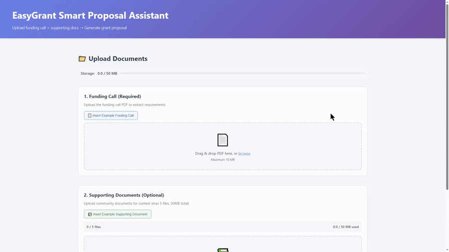
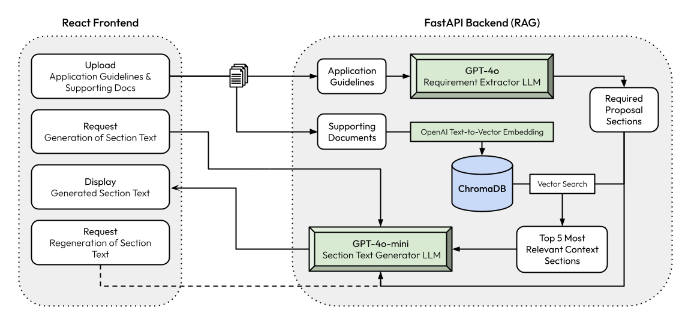

# EasyGrant 
*An LLM-powered grant proposal tool for easy funding applications.*

**Winner of Future Cities Institute & ElevenLabs Hackathon 2025**

🔗 <a href="https://easy-grant.vercel.app" target="_blank">Try it Live</a> | 🎥 <a href="https://www.youtube.com/watch?v=8mhfOFrtpFk" target="_blank">Watch Demo Video</a>

---

---

## Tech Stack

| Area            | Tools                                    |
| --------------- | ---------------------------------------- |
| Frontend        | React 18 + Vite 5                        |
| Backend         | FastAPI, pydantic, uvicorn, Starlette    |
| Vector Database | ChromaDB, OpenAI text-embedding-3-small  |
| Models          | OpenAI SDK; GPT-4o, GPT-4o-mini          |
| Parsing         | PyMuPDF, python-docx                     |
| Testing         | pytest                                   |
| Hosting         | Vercel (frontend), Render (backend)      |

---

## What It Does

<picture>
  <source media="(prefers-color-scheme: dark)" srcset="docs/assets/HighLevelDiagramDark.png">
  <source media="(prefers-color-scheme: light)" srcset="docs/assets/HighLevelDiagramLight.png">
  
</picture>

* **Pulls Local Context** — Upload community plans, budgets, or prior proposals
* **Extracts Requirements** — Auto-parses funding calls into a checklist
* **Writes Drafts w/ Citations** — Every claim points to source docs + page numbers
* **Keeps Your Edits** — Refines writing while preserving changes
* **Works in One Screen** — Linear, section-by-section drafting

---

## System Architecture

---

## Why We Built It

**Grant Applications Are:**

* Time-consuming  
* Confusing  
* Not standardized  
* Dependent on expensive consultants  

**EasyGrant Fixes This By:**  
* **Automating** writing by combining your context and funding details to draft responses instantly
* **Structuring** proposals into clear, modular sections, guiding applicants through each part from start to finish 
* **Parsing** requirements straight from application guidelines, adapting automatically to different formats
* **Enabling** researchers and communities to write complete, context-aware proposals independently, end-to-end
  
---

## Final Notes

* EasyGrant was built over the course of 8 hours for the FCI X ElevenLabs Hackathon 
* Future Improvements: make the editing process more interactive by improving the feedback loop between the AI and user
